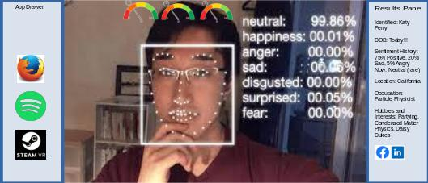
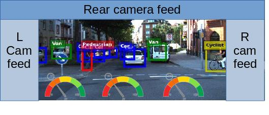
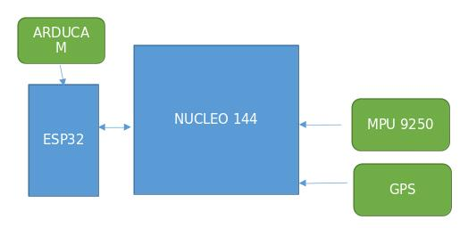

# OpenHUD
##   .life
##  .drive
##   .fly

 ------------
# OpenHUDware
##  .car
## .self
## .sky
--------------

## .intro
OpenHUD is a project that aims to provide an AR overlay for everyday use. The HUD consists of widgets which are overlaying an FPV feed. Current feeds that are available are
* .life
* .drive, and 
* .fly 

OpenHUDware is open source development hardware for OpenHUD application. 
* .self
* .car 
* .sky 

I'm particularly interested in using several widely available ML and CV APIs to provide overlay features. OpenHUD is based on the idea of fpv drone racing to overlay live video with critical information. Rather than using VR/AR for game-like interactions, OpenHUD approaches AR as an interface to enhance our experience of life. OpenHUD overlays a live camera stream with additional data about what is in view based on pretrained computer vision modules such as (Google vision API, Pre trained TF models, etc). The tags that are returned are used to determine what funtions to undertake next. Such as:
* user generated search
* transition between classifier models
* additional sensor data, or sensor filtering and analysis. 

Here's an example of the OpenHUD.self overlay with the results pane and app drawer open. In this example the facial recognition classifier has loaded information from the user's linked facebook account. There is also classifier data for sentiment analysis. Suggested actions are also presented to the user. 

OpenHUD also uses the classification tags to transition between classifier models. For example when the object recognition model returns "person" the following things happen. 
* the facial recognition model is launched
* stance is assessed
* facial analysis is undertaken to provide sentiment analysis 
* audio is enhanced using directional mic and filtering background.
* audio is also analysed
* if the person is known, all relevant information will be loaded. Linking to the users facebook account could provide most of these details. Along with phone contacts. The information is loaded into the info pane which is a default widget located in the right 'drawer' of the HUD (this can be changed in settings). 
* Events are also triggered for things like links, qr codes, plant ID, ect. and are relevant to the location. 

## .UserInteraction()
The CV generated tags and bounding boxes are presented to the user  who can choose what further funtions or apps to launch. this can be done by making the mouse pointer gesture with your hand and clicking on the item as you see it in your goggles, or making the speach command gesture to give a verbal command. OpenHUD also uses ML to learn what you like and pre-cache information and data that's more relevant to the user. (see context ContextEngine)

## .ContextEngine 
*move to separate project*

Feed the model all inputs actions results etc. use location to inform. Landmarks, image search, map search, could use targeted marketing style algorithms to refine suggestsions based on user habits. CD cover?  Linguistic trees: Scrape text from wiki and main google result for each identified item, word graph, drop most common words. The remaining words give meaning and context for the search item. Cluster them.

# OpenHUDwear
## 	.self
Like fpvcam/VR goggles but with front cam, environmental sensors. Display a customisable dashboard. Weather widget, hud apps. Additional environmental awareness such as facial recognition, mood detection, low light filters, zoom, directional mic? Track hand, gensture input, on hud items
       
###		components
                • 2 x LCD screen/sLS013B7DH03 DigiKey or Amazon.com: Treedix 3.5 inch TFT LCD Display 320 x 480
                • 2xARDUCAM 5MP PLUS OV5642 MINI CAM @ AU$73.17
                • ESP32-S3-WROOM-1-N8 DEV BRD @ AU$22.31
                • MPU-9250 GY-9250 9-axis gyro AU $11.79

##	.car
Addional envinmental awareness for road safety. There are plenty of existing vehicle HUDs that demostrate this idea. Sensor/360cam sensor data integrated into hud. Basically just feeds the camera to the goggles / image processing unit. Could include local processing. Final version replaces the car windscreen with an LCD running OpenHUD.If the car is self driving (this can be done pretty easily at a non-commercial level using ArduPilot(ROVER) as a test case), then additional functionality can be unlocked such as landmark info and context pane. If the car does not use self-driving capabilities, access to apps and distracting content must be locked. 

###		components
                • 4xARDUCAM 5MP PLUS OV5642 MINI CAM @ AU$73.17
                • ESP32-S3-WROOM-1-N8 DEV BRD @ AU$22.31
                • MPU-9250 GY-9250 9-axis gyro AU $11.79

For details on an opensource electric buggy with self-driving capabilities check out my other repo. Don't drive this thing on public roads... Control system is again, based on drones. See below for some idea.

## .sky
This was my first DIY drone. Built on the cheap using an untested flight controller I banged together out of a couple of dev boards and the ARDUPILOT code.
       
### components
	brain
    ▪ ESP32-S3-WROOM-1-N8 DEV BRD AU$22.31
    ▪ NUCLEO-144 STM32F767 DEV EVAL BD AU$36.39
    ▪ ARDUCAM 5MP PLUS OV5642 MINI CAM AU$73.17
    ▪ GPS MODULE W/ ANTENNA (NEO-M8N) AU$54.88
    ▪ MPU-9250 GY-9250 9-axis gyro AU $11.79

	base
    • F450 Flame Wheel KIT Drone With Camera 450 Frame For RC MK MWC 4 Axis RC Multicopter Quadcopter Heli Multi-Rotor with Land Gear AU$22.31
    • 2205 2300KV CW CCW Brushless Motor With LittleBee 20A/30A BLHeli_S ESC for FPV RC QAV250 X210 Racing Drone Multicopter AU $63.25x1
    • Youme 3S Lipo Battery 11.1V 5200mah 4500mah 3300mah 6500mah 50C 60C with T Plug XT60 XT90 For RC Drone Car Monster Boat Airplane AU $37.90x1 

### .construction()
               *add references*
ESP to FC Wiring
Wiring is very simple, and similar for all devices when connecting to the Pixhawk TELEM1/2 ports. You can use 2.54mm pitch header connectors or solder the PX4 telemetry cables directly to the board.

    1. Connect UART of ESP32 to a UART of your flight controller (e.g. TELEM 1 or TELEM 2 port). Make sure the voltage levels match: most ESP32 DevKits can only take 3.3V!
        ◦ TX to RX
        ◦ RX to TX
        ◦ GND to GND
        ◦ Provide a stable 3.3V or 5V power supply to the ESP32 (depending on the available inputs of your DevKit)
    2. Set the flight controller port to the desired protocol.
    3. Boards with an IPEX port for an external antenna often also offer an onboard antenna that is activated by default. You may need to resolder a resistor to activate the external antenna port.
Note
    • Follow the ESP32 board manufacturers recommendations on power supply. Some boards might have issues if they are simultaneously connected to a 5V power source and have a USB cable connected to the USB/Serial bridge (USB socket of the ESP32 dev board).
    • Some ESP32 DevKits manufacturers use the wrong labels for the pins on their products. Make sure that the PINs on your board are labeled correctly if you encounter issues.

## Firmware/Software
* Adrupilot on nucleo 144
* Dronebridge on esp32

ESP32 are readily available WiFi modules with dedicated UART, SPI and I2C interfaces, and full TCP/IP stack and microcontroller capability. They come without firmware, but DroneBridge for ESP32 can be installed to enable them as a transparent and bi-directional serial to WiFi bridge. They can then be used as a WiFi telemetry module with any Pixhawk series controller. No configuration is generally required if connected to TELEM2. The typical range is approximately 50m-200m (depending on the antenna used).

WARNING
Many ESP32 modules support 3.3V and 5V power supply input, while some flight controllers (e.g. Pixhawk 4) output at 5V. You will need to check compatibility and step down the voltage if needed.

The instructions on Github are recommended because they are always up to date. Note that the parameters may differ between releases of DroneBridge for ESP32.
The main steps are:
    1. Download the pre-compiled firmware binaries(opens new window)
    2. Connect your DEVKit to your computer via USB/Serial bridge (most DevKits already offer a USB port for flashing and debugging)
    3. Erase the flash and flash the DroneBridge for ESP32 firmware onto your ESP32
        ◦ Using Espressif Flash Download Tool (opens new window)(Windows only)
        ◦ Using esp-idf/esptool (all platforms)
    4. Power Cycle the ESP32
    5. Connect to the "DroneBridge for ESP32" WiFi network and configure the firmware for your application
       